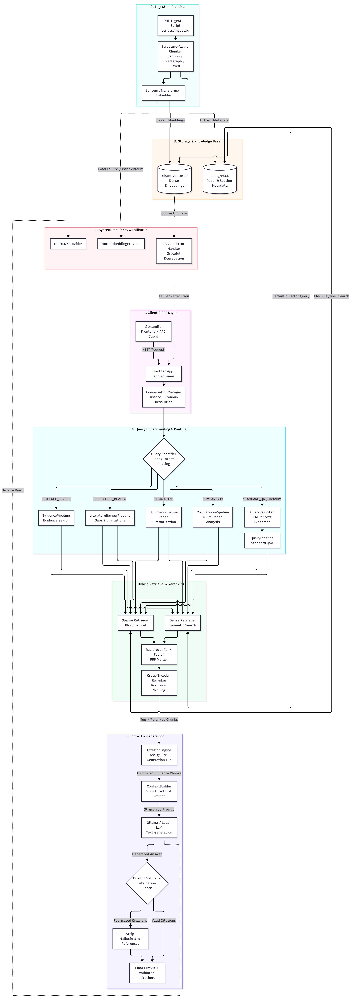

# 🔬 RAGLens

<p align="center">
  
</p>

<p align="center">
  <strong>Citation-Aware Research Paper Retrieval-Augmented Generation System</strong>
</p>

<p align="center">
  <a href="#-overview">Overview</a> •
  <a href="#-core-idea">Core Idea</a> •
  <a href="#-architecture">Architecture</a> •
  <a href="#-rag-quality-improvements">RAG Improvements</a> •
  <a href="#-features">Features</a> •
  <a href="#-tech-stack">Tech Stack</a> •
  <a href="#-quick-start">Quick Start</a> •
  <a href="#-api-reference">API</a> •
  <a href="#-testing">Testing</a>
</p>

---

## 📌 Overview

**RAGLens** is a citation-aware Retrieval-Augmented Generation (RAG) platform designed specifically for **academic research papers**.

Unlike a basic RAG pipeline that simply embeds documents and retrieves similar chunks, RAGLens combines:

* Structure-aware PDF parsing
* Dense vector retrieval
* Sparse BM25 retrieval
* Reciprocal Rank Fusion (RRF)
* Cross-encoder reranking
* Specialized query pipelines
* Conversational context handling
* Deterministic citation assignment
* Post-generation citation validation
* Local LLM inference through Ollama

The goal is to provide **grounded answers where generated claims can be traced back to the retrieved sections of the original research papers**.

---

# 🎯 Core Idea

Research papers introduce several challenges for conventional RAG systems.

### Problems with naive RAG

| Problem                 | Why it matters                                                             |
| ----------------------- | -------------------------------------------------------------------------- |
| Fixed-size chunking     | Important equations or explanations can be split across chunks             |
| Dense-only retrieval    | Exact scientific terminology may not be retrieved reliably                 |
| Keyword-only retrieval  | Semantic relationships and paraphrases are missed                          |
| Large candidate sets    | Irrelevant chunks can consume LLM context                                  |
| LLM-generated citations | Models can fabricate citation numbers                                      |
| Multi-turn questions    | Pronouns such as "it", "this model", or "that paper" can become ambiguous  |
| Generic QA pipeline     | Different research tasks require different retrieval/generation strategies |

### RAGLens approach

RAGLens addresses these problems through a multi-stage pipeline:

```text
Research Paper PDFs
       │
       ▼
Structure-Aware Parsing
       │
       ▼
Metadata-Aware Chunking
       │
       ├───────────────┐
       ▼               ▼
Dense Retrieval    BM25 Retrieval
       │               │
       └───────┬───────┘
               ▼
        RRF Rank Fusion
               │
               ▼
      Cross-Encoder Reranking
               │
               ▼
       Citation Assignment
               │
               ▼
        Context Construction
               │
               ▼
          Local LLM
               │
               ▼
      Citation Validation
               │
               ▼
      Grounded Final Answer
```

---

# 🏗 Architecture

<p align="center">
  
</p>

## System Flow

```text
User Query
    │
    ▼
Streamlit Frontend / REST API
    │
    ▼
FastAPI Application
    │
    ▼
ConversationManager
    │
    │  History Tracking
    │  Pronoun Resolution
    ▼
QueryClassifier
    │
    ├── EVIDENCE_SEARCH
    ├── LITERATURE_REVIEW
    ├── SUMMARIZE
    ├── COMPARISON
    └── STANDARD_QA
             │
             ▼
       Query Pipeline
             │
       ┌─────┴─────┐
       ▼           ▼
Dense Retrieval  Sparse Retrieval
(Qdrant)         (BM25)
       │           │
       └─────┬─────┘
             ▼
     Reciprocal Rank Fusion
             │
             ▼
      Cross-Encoder Reranker
             │
             ▼
        CitationEngine
             │
             ▼
        ContextBuilder
             │
             ▼
       Ollama Local LLM
             │
             ▼
      CitationValidator
             │
             ▼
     Final Grounded Response
```

---

# 🧠 RAG Quality Improvements

RAGLens uses multiple retrieval and generation techniques rather than relying on a basic vector-search pipeline.

## 1. Structure-Aware PDF Chunking

Instead of blindly splitting PDFs based on character count, RAGLens preserves document structure.

Each chunk can retain metadata such as:

```text
paper_id
paper_title
section_name
subsection
page_number
chunk_id
text
```

This allows retrieved evidence to maintain its relationship with the original paper.

### Benefits

* Preserves section boundaries
* Reduces broken explanations
* Keeps page information
* Improves citation traceability
* Provides richer metadata to the LLM

---

## 2. Hybrid Dense + Sparse Retrieval

RAGLens combines two complementary retrieval strategies.

### Dense Retrieval

Uses:

* Qdrant
* Sentence Transformers

Dense retrieval captures:

* Semantic similarity
* Conceptual relationships
* Paraphrased queries
* Related terminology

### Sparse Retrieval

Uses:

* BM25

BM25 is useful for:

* Exact terminology
* Model names
* Scientific keywords
* Mathematical terms
* Dataset names
* Acronyms

### Why combine them?

A query such as:

```text
What optimizer was used for training?
```

may benefit from semantic retrieval.

A query such as:

```text
What is the BLEU score of T5?
```

may benefit heavily from exact lexical matching.

Combining both approaches provides complementary retrieval signals.

---

# 🔀 Reciprocal Rank Fusion

After dense and sparse retrieval, RAGLens combines their rankings using **Reciprocal Rank Fusion (RRF)**.

Conceptually:

```text
Dense Results
     │
     ├── Rank 1
     ├── Rank 2
     ├── Rank 3
     └── ...

Sparse Results
     │
     ├── Rank 1
     ├── Rank 2
     ├── Rank 3
     └── ...
          │
          ▼
      RRF Fusion
          │
          ▼
 Unified Candidate Ranking
```

RRF allows the system to combine rankings without requiring both retrieval systems to produce directly comparable scores.

---

# 🎯 Cross-Encoder Reranking

Initial retrieval intentionally retrieves a larger candidate set.

For example:

```text
top_k = 30
```

The candidates are then passed through a cross-encoder.

Conceptually:

```text
Query + Candidate Chunk
          │
          ▼
    Cross Encoder
          │
          ▼
 Relevance Score
```

The highest-quality candidates are then selected for the final LLM context.

### Retrieval pipeline

```text
Query
  ↓
Dense Retrieval
  ↓
BM25 Retrieval
  ↓
RRF
  ↓
Top 30 Candidates
  ↓
Cross-Encoder
  ↓
Top Relevant Evidence
```

This separates:

**Recall-oriented retrieval**

from

**Precision-oriented reranking**

---

# 📚 Citation-Aware Generation

Citation reliability is a core part of RAGLens.

Instead of allowing the LLM to freely invent citation numbers, RAGLens assigns citation IDs before generation.

For example:

```text
[1] Paper A — Page 4 — Section: Methodology
[2] Paper B — Page 7 — Section: Experiments
[3] Paper A — Page 9 — Section: Results
```

The LLM receives these evidence references as part of the context.

It can then generate:

```text
The model achieved its best performance using the proposed
attention mechanism [1].
```

---

# 🛡 Citation Validation

After generation, `CitationValidator` checks the generated response.

```text
Generated Response
        │
        ▼
CitationValidator
        │
        ├── Valid citation?
        │       │
        │       └── Yes → Keep
        │
        └── Invalid citation
                │
                └── Strip / Flag
```

This prevents references such as:

```text
[17]
[42]
[99]
```

from appearing when those citation IDs were never assigned by the retrieval system.

> RAGLens validates whether citation IDs correspond to retrieved evidence; citation validation does not by itself prove that every generated claim is scientifically correct.

---

# 🧩 Multi-Pipeline Query Routing

Different research questions require different processing strategies.

RAGLens therefore classifies queries before execution.

## Supported Pipelines

### 🔎 Query Pipeline

Used for standard multi-turn research questions.

```text
Question
   ↓
Query Rewriting
   ↓
Hybrid Retrieval
   ↓
Reranking
   ↓
Grounded Answer
```

---

### 📖 Evidence Pipeline

Designed to locate direct evidence for a scientific claim.

Example:

```text
"What evidence does the paper provide that the proposed
method improves accuracy?"
```

The pipeline prioritizes relevant supporting passages.

---

### 📚 Literature Review Pipeline

Designed for questions involving multiple papers.

Example:

```text
"What are the major approaches used for RAG evaluation
in the retrieved papers?"
```

It can synthesize:

* Research trends
* Common methodologies
* Limitations
* Research gaps
* Supporting evidence

---

### ⚖️ Comparison Pipeline

Designed for structured paper comparisons.

Example:

```text
"Compare Paper A and Paper B based on architecture,
datasets, evaluation metrics and results."
```

---

### 📝 Summary Pipeline

Produces structured summaries of research papers.

Possible sections include:

```text
Problem
Methodology
Architecture
Dataset
Experiments
Results
Limitations
Conclusion
```

---

# 💬 Conversational Context & Query Rewriting

Research conversations often contain ambiguous follow-up questions.

For example:

```text
User:
What architecture does the paper use?

User:
How many layers does it have?

User:
What dataset was used to train it?
```

The second question cannot always be interpreted correctly in isolation.

RAGLens uses `ConversationManager` and `QueryRewriter` to transform contextual questions into explicit search queries.

Example:

```text
"How many layers does it have?"
                ↓
"How many layers does the Transformer encoder
architecture described in the selected paper contain?"
```

This improves retrieval for multi-turn conversations.

---

# 🛡 Graceful Degradation & Resiliency

RAGLens includes fallback components for development and testing.

Available fallback mechanisms include:

* `MockEmbeddingProvider`
* `MockLLMProvider`
* `RAGLensError`
* API health checks
* Isolated pipeline tests

This allows parts of the system to be tested without requiring:

* A running LLM
* GPU inference
* Production vector infrastructure

---

# ✨ Features

* 📄 Academic PDF ingestion
* 🧩 Structure-aware document chunking
* 🔎 Dense semantic retrieval
* 🔤 BM25 lexical retrieval
* 🔀 Reciprocal Rank Fusion
* 🎯 Cross-encoder reranking
* 📚 Multi-paper literature review
* ⚖️ Research paper comparison
* 📝 Structural paper summarization
* 💬 Multi-turn conversational QA
* 🔄 Query rewriting
* 🔖 Deterministic citation assignment
* 🛡 Citation validation
* 🦙 Local LLM inference with Ollama
* 🚀 FastAPI REST API
* 🖥️ Optional Streamlit frontend
* 🧪 Mock providers for testing
* 🐳 Docker-based infrastructure

---

# 🛠 Tech Stack

| Component           | Technology              |
| ------------------- | ----------------------- |
| Language            | Python 3.14             |
| API                 | FastAPI                 |
| Validation          | Pydantic                |
| Configuration       | Pydantic Settings       |
| Vector Database     | Qdrant                  |
| Relational Database | PostgreSQL              |
| Dense Retrieval     | Sentence Transformers   |
| Sparse Retrieval    | BM25                    |
| Reranking           | Cross-Encoder           |
| ML Framework        | PyTorch                 |
| Local LLM           | Ollama                  |
| Frontend            | Streamlit               |
| Containerization    | Docker / Docker Compose |
| Testing             | Pytest                  |
| API Testing         | FastAPI TestClient      |

---

# 📁 Project Structure

```text
RAGLens/
│
├── app/
│   ├── api/
│   │   └── main.py
│   │
│   ├── pipelines/
│   │   ├── query_pipeline.py
│   │   ├── evidence_pipeline.py
│   │   ├── literature_review.py
│   │   ├── comparison.py
│   │   └── summarize.py
│   │
│   ├── retrieval/
│   │   ├── dense.py
│   │   ├── sparse.py
│   │   ├── fusion.py
│   │   └── reranker.py
│   │
│   ├── citation/
│   │   ├── engine.py
│   │   └── validator.py
│   │
│   ├── conversation/
│   │   └── manager.py
│   │
│   ├── ingestion/
│   │   ├── parser.py
│   │   └── chunker.py
│   │
│   └── providers/
│       ├── embeddings.py
│       ├── llm.py
│       └── mocks.py
│
├── scripts/
│   └── ingest.py
│
├── frontend/
│   └── streamlit_app.py
│
├── data/
│   └── raw/
│
├── tests/
│
├── docs/
│   └── architecture.png
│
├── .env.example
├── docker-compose.yml
├── requirements.txt
└── README.md
```

---

# ⚡ Quick Start

## 1. Clone the Repository

```bash
git clone <YOUR_REPOSITORY_URL>
cd RAGLens
```

---

## 2. Create Environment Configuration

Copy the example environment file:

```bash
cp .env.example .env
```

On Windows CMD:

```cmd
copy .env.example .env
```

Configure the required database, Qdrant, embedding, and LLM settings inside `.env`.

---

## 3. Start Infrastructure

Start PostgreSQL and Qdrant:

```bash
docker compose up -d
```

Verify the containers:

```bash
docker compose ps
```

---

## 4. Create a Python Environment

### Windows

```cmd
python -m venv .venv
.venv\Scripts\activate
```

### Linux / macOS

```bash
python3 -m venv .venv
source .venv/bin/activate
```

---

## 5. Install Dependencies

```bash
pip install -r requirements.txt
```

---

# 🦙 6. Configure Ollama

Install and start Ollama, then pull the model configured by your project.

For example:

```bash
ollama pull <MODEL_NAME>
```

Verify the model:

```bash
ollama list
```

Make sure the model name in `.env` matches the model available locally.

---

# 🚀 7. Start the FastAPI Server

```bash
python -m uvicorn app.api.main:app --reload --host 0.0.0.0 --port 8000
```

The API will be available at:

```text
http://localhost:8000
```

Interactive API documentation:

```text
http://localhost:8000/docs
```

---

# 📄 8. Ingest Research Papers

Place PDFs inside:

```text
data/raw/
```

Then run:

```bash
python scripts/ingest.py data/raw/*.pdf
```

The ingestion pipeline performs the required processing:

```text
PDF
 ↓
Parsing
 ↓
Structure Extraction
 ↓
Chunking
 ↓
Metadata Attachment
 ↓
Embedding
 ↓
Qdrant Indexing
 ↓
BM25 Indexing
```

---

# 🖥️ 9. Start the Streamlit Frontend

The frontend is optional.

```bash
streamlit run frontend/streamlit_app.py
```

---

# 🔌 API Reference

## Health & Monitoring

### `GET /`

Returns basic application metadata.

### `GET /health`

Checks the health of:

* PostgreSQL
* Qdrant
* Local LLM

### `GET /health/liveness`

Returns the API liveness status.

---

# 📚 Papers & Ingestion

### `POST /papers/upload`

Upload and parse a research paper PDF.

### `POST /papers/ingest`

Ingest papers from a configured directory.

### `GET /papers`

List ingested research papers.

### `GET /papers/{paper_id}`

Retrieve metadata for a specific paper.

### `GET /papers/{paper_id}/chunks`

Retrieve processed chunks belonging to a paper.

---

# 🔎 Query & Search

### `POST /query`

Execute a citation-aware research question.

```text
User Question
      ↓
Intent Classification
      ↓
Query Rewriting
      ↓
Hybrid Retrieval
      ↓
RRF
      ↓
Reranking
      ↓
Citation Mapping
      ↓
LLM Generation
      ↓
Citation Validation
      ↓
Final Answer
```

---

### `POST /search`

Search the indexed research corpus using hybrid retrieval.

---

### `POST /summarize`

Generate a structural summary of a research paper.

---

### `POST /compare`

Compare multiple research papers.

---

### `POST /literature-review`

Generate a literature review based on retrieved papers and evidence.

---

# 🧪 Testing

RAGLens includes automated tests covering:

* Configuration
* API routes
* Retrieval pipelines
* Query routing
* Citation assignment
* Citation validation
* Mock providers
* Error handling

Run the complete test suite:

```bash
pytest
```

For verbose output:

```bash
pytest -v
```

---

# 🔬 Example Research Workflow

A typical RAGLens workflow looks like:

```text
1. Upload research papers
          ↓
2. Parse PDF structure
          ↓
3. Generate metadata-aware chunks
          ↓
4. Create dense embeddings
          ↓
5. Build BM25 index
          ↓
6. Store vectors in Qdrant
          ↓
7. User asks a research question
          ↓
8. Classify query intent
          ↓
9. Rewrite contextual query
          ↓
10. Dense + BM25 retrieval
          ↓
11. RRF fusion
          ↓
12. Cross-encoder reranking
          ↓
13. Assign deterministic citations
          ↓
14. Build grounded context
          ↓
15. Generate answer using Ollama
          ↓
16. Validate citations
          ↓
17. Return grounded response
```

---

# 🎯 Design Goals

RAGLens is designed around four primary goals:

### 1. Better Retrieval

Combine semantic and lexical retrieval instead of depending on a single retrieval strategy.

### 2. Better Evidence Selection

Use reranking to reduce irrelevant context before generation.

### 3. Better Citation Reliability

Assign and validate citations outside the LLM's free-form generation process.

### 4. Better Research Workflows

Provide specialized pipelines for:

* Question answering
* Evidence extraction
* Summarization
* Paper comparison
* Literature review

---

# 🚧 Future Improvements

Potential future extensions include:

* [ ] Graph-based research paper retrieval
* [ ] Knowledge graph construction
* [ ] Table and figure extraction
* [ ] Mathematical equation-aware chunking
* [ ] Multi-modal PDF understanding
* [ ] Automatic claim-to-evidence verification
* [ ] Citation correctness scoring
* [ ] Retrieval evaluation benchmarks
* [ ] RAG evaluation with RAGAS / custom metrics
* [ ] Streaming responses
* [ ] Background document ingestion
* [ ] Research-paper recommendation
* [ ] Multi-user authentication
* [ ] Cloud deployment

---

# 📊 Evaluation

RAGLens can be evaluated across multiple stages of the RAG pipeline.

### Retrieval

Possible metrics:

```text
Recall@K
Precision@K
MRR
nDCG
Hit Rate
```

### Generation

Possible metrics:

```text
Faithfulness
Answer Relevance
Context Relevance
Citation Precision
Citation Recall
```

### System

Possible metrics:

```text
End-to-End Latency
Retrieval Latency
Reranking Latency
LLM Generation Latency
Throughput
```

---

# 🔐 Local-First Design

RAGLens can use **Ollama for local LLM inference**, allowing research documents to remain on the local machine instead of requiring every document to be sent to an external LLM API.

The architecture is therefore suitable for experimentation with:

* Private research documents
* Internal technical papers
* Local development
* Offline-capable components
* Reproducible RAG experiments

---

# 📜 License

Add your project license here.

For example:

```text
MIT License
```

---

# 👨‍💻 Author

**Rajasimha Merugumalla**

Built as a research-oriented RAG system for exploring:

* Retrieval-Augmented Generation
* Hybrid Search
* Information Retrieval
* LLM Grounding
* Citation Validation
* Research Paper Understanding
* Multi-Pipeline RAG Architectures
